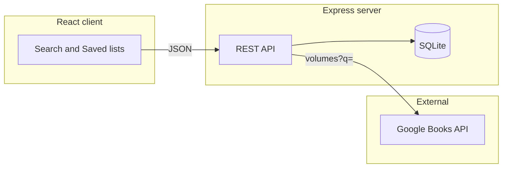

# Book Finder app — build plan

## Architecture (high level)



- **Frontend**: Calls your API only (no Google API key in the browser). Search and “saved books” go through Express.
- **Backend**: Holds the Google API key in env, proxies search to Google Books, persists user-saved volumes in SQLite.

---

## Proposed folder structure

Single repo with two packages (no need for npm workspaces unless you want one lockfile—optional).

```text
book-finder/
├── README.md
├── .env.example                 # GOOGLE_BOOKS_API_KEY, PORT, CLIENT_URL, DATABASE_PATH
├── client/
│   ├── index.html
│   ├── vite.config.ts
│   ├── package.json
│   ├── tsconfig.json
│   ├── src/
│   │   ├── main.tsx
│   │   ├── App.tsx
│   │   ├── api.ts               # fetch wrappers for /api/*
│   │   ├── components/
│   │   │   ├── SearchBar.tsx
│   │   │   ├── BookCard.tsx
│   │   │   └── SavedList.tsx
│   │   └── types.ts             # Book, SavedBook shared shapes
│   └── public/
├── server/
│   ├── package.json
│   ├── tsconfig.json
│   ├── src/
│   │   ├── index.ts             # app.listen, CORS, JSON
│   │   ├── db.ts                # better-sqlite3 init + migrations
│   │   ├── routes/
│   │   │   ├── health.ts
│   │   │   ├── books.ts         # GET /search → Google
│   │   │   └── saved.ts         # CRUD saved
│   │   ├── services/
│   │   │   └── googleBooks.ts   # fetch volumes, map response
│   │   └── types.ts
│   └── data/
│       └── .gitkeep             # sqlite file path e.g. data/books.db (gitignore the .db)
```

**Notes**

- Use **Vite + React + TypeScript** for the client; **Express + TypeScript** for the server.
- **`better-sqlite3`** (sync, simple) or **`sql.js`** if you prefer fewer native deps—pick one and stick to it.
- **CORS**: allow `CLIENT_URL` (e.g. `http://localhost:5173`) in development.

---

## Database schema (SQLite)

Minimal schema focused on “saved books” from Google Volume IDs.

**Table: `saved_books`**

| Column | Type | Notes |
|--------|------|--------|
| `id` | INTEGER PRIMARY KEY AUTOINCREMENT | Local row id |
| `google_volume_id` | TEXT NOT NULL UNIQUE | Stable id from Google Books |
| `title` | TEXT NOT NULL | Denormalized for fast list display |
| `authors` | TEXT | JSON array string, e.g. `["A","B"]` |
| `thumbnail_url` | TEXT NULL | Small cover image URL |
| `preview_link` | TEXT NULL | Optional link back to Google Books |
| `created_at` | TEXT NOT NULL DEFAULT (datetime('now')) | ISO-ish timestamp |

**Indexes**: unique on `google_volume_id` (enforced by UNIQUE); optional index on `created_at DESC` for “recent saves.”

No need for a separate “search history” table in v1 unless you explicitly want it later.

---

## API routes (REST)

Base path: `/api` (keeps proxies and static clear).

| Method | Path | Purpose |
|--------|------|--------|
| GET | `/api/health` | `{ ok: true }` — uptime checks |
| GET | `/api/books/search` | Query params: `q` (required), `startIndex` or `page` (optional). Proxies to Google Books `volumes` API; returns normalized list + totalItems |
| GET | `/api/saved` | List all rows from `saved_books`, newest first |
| POST | `/api/saved` | Body: `{ googleVolumeId, title, authors?, thumbnailUrl?, previewLink? }`. Upsert or 409 if you prefer strict create-only |
| DELETE | `/api/saved/:id` | Delete by local `id` |

**Optional (nice-to-have)**

- GET `/api/saved/check/:googleVolumeId` — boolean “already saved” for UI (or include flags in search by joining in memory after fetch—simpler for v1).

**Google Books**

- Use `https://www.googleapis.com/books/v1/volumes` with `key=` from env (or public quota without key if acceptable for demos—key recommended).
- Map each `volume` to a slim DTO: `id`, `title`, `authors`, `thumbnail`, `description` (truncated), `previewLink`.

---

## Environment variables

- **`GOOGLE_BOOKS_API_KEY`**: server-only.
- **`PORT`**: e.g. `3001`.
- **`CLIENT_URL`**: CORS origin.
- **`DATABASE_PATH`**: e.g. `./data/books.db`.

Document all in `.env.example`; never commit `.env` or `*.db` if you prefer (add to `.gitignore`).

---

## Step-by-step build order (milestones)

**Milestone 1 — Server skeleton**

- Init `server/`, Express, TypeScript, `dotenv`, CORS, JSON body parser.
- `GET /api/health`.
- SQLite connection + create `saved_books` table on startup (simple migration string in `db.ts`).

**Milestone 2 — Google Books search**

- `services/googleBooks.ts`: build query string, handle errors (429, invalid key), normalize JSON.
- `GET /api/books/search` with validation (`q` required).
- Manual test with curl or Thunder Client.

**Milestone 3 — Saved books API**

- `GET /api/saved`, `POST /api/saved`, `DELETE /api/saved/:id`.
- Validate POST body; use UNIQUE on `google_volume_id` and return clear errors.

**Milestone 4 — React client (search)**

- Init Vite React TS in `client/`.
- Search UI: input, results grid/list, loading and error states.
- `api.ts` pointing to `http://localhost:3001` via Vite `proxy` in `vite.config.ts` or `import.meta.env.VITE_API_URL`.

**Milestone 5 — Saved books UI**

- “Save” on each result; list saved books page or section; delete with confirm.
- Optional: disable “Save” when already saved (using local state after GET `/api/saved` or optional check endpoint).

**Milestone 6 — Polish**

- README: how to get a Google Books API key, `npm run dev` for both sides, env copy-paste.
- `.gitignore` for `node_modules`, `.env`, `data/*.db`.
- Basic accessibility (labels, buttons) and empty states.

---

## Success criteria (v1)

- Search works end-to-end without exposing API keys to the client.
- Saved books persist across server restarts.
- Clear errors when Google API fails or rate-limits.

---

## Optional extensions (post-v1)

- Pagination UI aligned with `startIndex` / `maxResults`.
- Full-text search on saved titles locally (SQLite `FTS5`).
- Docker Compose for one-command dev.
